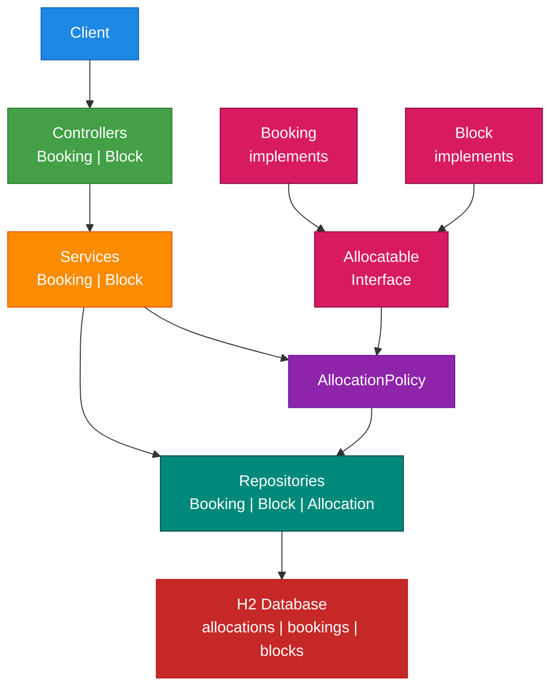

# Booking Service

## Overview
- REST API for managing bookings and property blocks.
- Ensures no date overlaps between active bookings and blocks for the same property.
- Built with Spring Boot 3, Java 17, H2 (in-memory), JPA, Validation, and springdoc OpenAPI.

## Architecture



## Design & Architecture
- Entities: Booking, Block (separate, clear responsibilities).
- Policy extraction: AvailabilityPolicy centralizes overlap checks for reuse.
- Services: BookingService, BlockService orchestrate actions, validation, and policy enforcement.
- Controllers: REST endpoints with DTOs and MapStruct mappers.
- i18n: Error messages are resolved from MessageSource (English bundle). Accept-Language can be used, but only English is provided.

## Scope decisions
- Why not model Property/Guest/Owner now:
  - The exercise doesn't require authentication, property catalog, or user management.
  - Adding entities and relationships would increase persistence, mapping, and test complexity without changing the core overlap rules.
  - Current needs are met by `propertyId` and embedded guest data on the booking.
  - When to add later: if we need ownership/roles, property validation, reporting, or user history/preferences.
- Why not hexagonal (ports/adapters) right now:
  - The scope uses an in-memory DB and a single REST adapter; introducing ports adds layers and boilerplate for little benefit in this context.
  - The code already separates concerns (controllers -> services -> policy/repositories); it's easy to promote to hexagonal later if new adapters appear (e.g., messaging, CLI, different persistence).
  - When to adopt: multiple adapters, external integrations, or the need to swap infrastructure easily.
- Why a Unified `Allocation` Table?
Instead of querying `bookings` and `blocks` separately for overlap checks (2 queries), we created a single `Allocation` table:
  - Single Query: `AllocationPolicy` queries only `allocations` (indexed lookup) instead of 2 table scans.
  - Polymorphism: Both Booking and Block implement `Allocatable`, allowing shared logic via `AllocationPolicy`.
  - Scalability: At millions of records, one indexed query vastly outperforms multiple table scans + in-memory filtering.
  - Extensible: New allocation types (e.g., holds, maintenance) simply implement `Allocatable`; no new overlap logic needed.
  - Trade-Off
    - Cost: Extra storage + sync overhead.
    - Benefit: Dramatically faster queries, simpler code.
    - Verdict: Query performance wins at scale.
- Validation & Business Rules
  - Input validation: DTOs use @Valid (required fields, email format); services enforce domain invariants.
  - Date invariants: endDate >= startDate.
  - Overlaps:
    - Booking vs booking: cannot overlap any non-canceled booking for the same property.
    - Booking vs block: cannot overlap any block for the same property.
    - Block vs booking: cannot overlap any active booking for the same property.
    - Block vs block: cannot overlap any block for the same property.
  - Error mapping (GlobalExceptionHandler):
    - 400 BAD_REQUEST: invalid data.
    - 404 NOT_FOUND: resource not found.
    - 409 CONFLICT: date overlap conflicts.
- Tips
  - Dates must be ISO-8601 (YYYY-MM-DD).
  - Use the response `Location` header to capture created resource IDs.
  - Validation and conflict messages are returned in English with a consistent JSON error body.

## Project Structure (high-level)

```
src/main/java/com/bookingservice
├─ api/                # Controllers, DTOs, exception handler
├─ config/             # OpenAPI config, Web config
├─ model/              # JPA entities and enums (Booking, Block, Allocation, Allocatable)
├─ repository/         # Spring Data JPA repositories (Booking, Block, Allocation)
├─ service/            # Services (Booking, Block) and policy (AllocationPolicy)
└─ support/            # Custom exceptions (NotFoundException)

src/test/java/com/bookingservice
├─ controller/         # MockMvc API tests (Given/When/Then style)
├─ service/            # Service tests (Given/When/Then style)
└─ service/policy/     # Allocation policy tests
```

## Development
- Style: Given/When/Then test naming for readability.
- Lombok: used on entities (Getter/Setter/Builder/NoArgs/AllArgs) to reduce boilerplate.

## Features
- Create, update, cancel, rebook, delete, and get bookings.
- Create, update, and delete blocks.
- Overlap prevention:
  - Bookings cannot overlap active bookings or blocks for the same property.
  - Blocks cannot overlap active bookings or other blocks for the same property.
- Validation with clear error responses (400/404/409).
- Swagger UI documentation.

## Tech Stack
- Java 17, Spring Boot 3 (Web, Data JPA, Validation)
- H2 (in-memory DB)
- Records (immutable DTOs)
- Lombok (boilerplate reduction for JPA entities only)
- springdoc-openapi (Swagger UI)
- JUnit 5, Spring Test (MockMvc)

## Quick Start

### Prerequisites
- Java 17+
- Maven 3.9+
- Docker (optional, for container run)

### Run tests

```bash
mvn test
```

Run locally (Dev)

```bash
mvn spring-boot:run
# App runs on http://localhost:8080
```

Run with Docker

```bash
docker compose up --build
# App runs on http://localhost:8080
```

Run Docker build with tests (CI-friendly)
- Build and run unit/integration tests inside Docker (fails build if tests fail):

```bash
docker build --target test .
# or with compose
docker compose build tests
```

Build runtime image only (skip tests during image build)

```bash
docker build --target runtime -t booking-service:latest .
docker run --rm -p 8080:8080 booking-service:latest
```

### API Documentation
- Swagger UI: http://localhost:8080/swagger-ui.html
- OpenAPI JSON: http://localhost:8080/v3/api-docs

### H2 Console
- Console: http://localhost:8080/h2-console
- JDBC URL: jdbc:h2:mem:bookingdb
- User: sa (no password)

## Key Endpoints

### Bookings
- POST /api/bookings
- GET /api/bookings/{id}
- PUT /api/bookings/{id}
- POST /api/bookings/{id}/cancel
- POST /api/bookings/{id}/rebook
- DELETE /api/bookings/{id}
- GET /api/bookings/calendar (list by property and month)

### Blocks
- POST /api/blocks
- PUT /api/blocks/{id}
- DELETE /api/blocks/{id}
- GET /api/blocks/calendar (list by property and month)

## Internationalization (i18n)

The API supports multiple languages via the `lang` query parameter:
- English (default): `?lang=en_US`
- Portuguese (Brazil): `?lang=pt_BR`

Example:
```bash
curl "http://localhost:8080/api/bookings?lang=pt_BR" \
  -H "Content-Type: application/json" \
  -d '{"propertyId":"prop","guestName":"","guestEmail":"invalid"}'
```

Response (Portuguese error messages):
```json
{
  "error": "BAD_REQUEST",
  "message": "Nome do hóspede é obrigatório",
  "timestamp": "2025-11-15T10:30:00Z"
}
```

## Request/Response Examples

### Create booking

```bash
curl -X POST http://localhost:8080/api/bookings \
  -H "Content-Type: application/json" \
  -d '{
        "propertyId": "property-123",
        "guestName": "John Doe",
        "guestEmail": "john@example.com",
        "startDate": "2025-12-01",
        "endDate": "2025-12-05"
      }'
```


### Get booking

```bash
BOOKING_ID=<replace-with-booking-uuid>
curl -X GET http://localhost:8080/api/bookings/$BOOKING_ID
```

### Update booking

```bash
BOOKING_ID=<replace-with-booking-uuid>
curl -X PUT http://localhost:8080/api/bookings/$BOOKING_ID \
  -H "Content-Type: application/json" \
  -d '{
        "guestName": "Jane Doe",
        "guestEmail": "jane.doe@example.com",
        "startDate": "2025-12-02",
        "endDate": "2025-12-06"
      }'
```

### Cancel booking

```bash
BOOKING_ID=<replace-with-booking-uuid>
curl -X POST http://localhost:8080/api/bookings/$BOOKING_ID/cancel
```

### Rebook canceled booking

```bash
BOOKING_ID=<replace-with-booking-uuid>
curl -X POST http://localhost:8080/api/bookings/$BOOKING_ID/rebook
```

### Delete booking

```bash
BOOKING_ID=<replace-with-booking-uuid>
curl -X DELETE http://localhost:8080/api/bookings/$BOOKING_ID
```

### Create block

```bash
curl -X POST http://localhost:8080/api/blocks \
  -H "Content-Type: application/json" \
  -d '{
        "propertyId": "property-123",
        "startDate": "2025-12-10",
        "endDate": "2025-12-12"
      }'
```

### Update block

```bash
BLOCK_ID=<replace-with-block-uuid>
curl -X PUT http://localhost:8080/api/blocks/$BLOCK_ID \
  -H "Content-Type: application/json" \
  -d '{
        "propertyId": "property-123",
        "startDate": "2025-12-11",
        "endDate": "2025-12-13"
      }'
```

### Delete block

```bash
BLOCK_ID=<replace-with-block-uuid>
curl -X DELETE http://localhost:8080/api/blocks/$BLOCK_ID
```


## Build

```bash
mvn clean package
```

## Continuous Integration (GitHub Actions)
- The repository includes a CI workflow that builds the Docker test stage (runs mvn test inside Docker) on push and pull requests.
- File: .github/workflows/ci.yml
- Local equivalent:

```bash
docker build --target test .
```

## Run JAR

```bash
java -jar target/booking-service-0.0.1-SNAPSHOT.jar
```

## Configuration
- application.yml configures H2, JPA (ddl-auto=update), server port (8080), and H2 console.
- Environment variables are not required for basic usage.

## RFC
- See docs/RFC-Booking-Service.md for context, goals, data model, API, and trade-offs.

## Notes
- This service uses an in-memory database (H2) for simplicity in the technical test; data is volatile.
- For production, replace H2 with a persistent database and add authentication/authorization.


